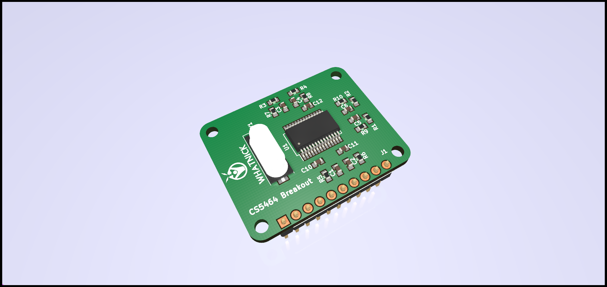

# CS5464 Cirrus Logic AC-Energy Monitor Breakout

Minimal breakout board to test and develop drivers for the Cirrus Logic CS5464 Single-phase Energy Monitor ASIC.

Arduino code available [here](https://github.com/whatnick/CS5464_Arduino)

Features include:
- RC networks for sampling Voltage and Current.
- Crystal to provide clock to ASIC.

# Board Plots

## Board Front

## Board Back

## 3D Render
